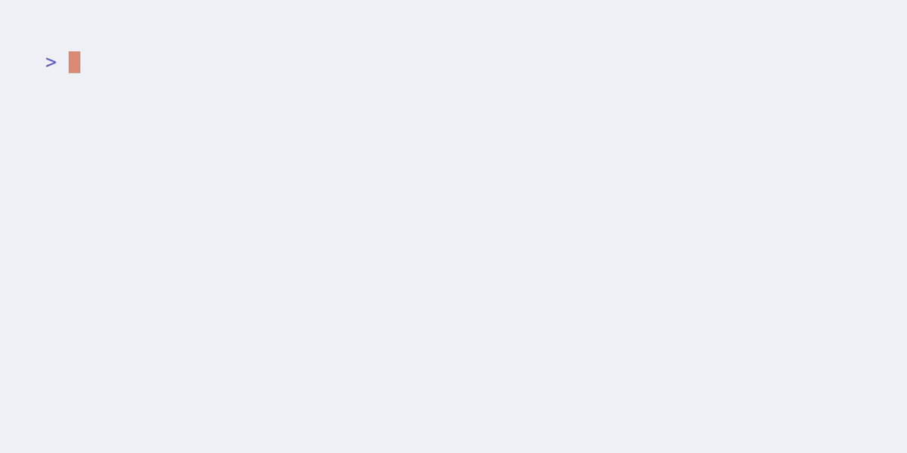
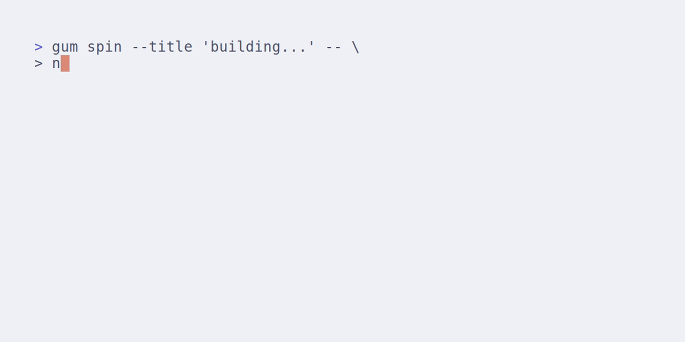

# Reproducible Builds and Environments with Nix
#### Golang Bristol - 17/09/2024

This repo contains the demo code and final Presentation for the September Golang Meetup in Bristol

It shows a basic example of how Nix could be used to create reproducible builds and environments in Go Projects

## How to use

> The following nix commands should be executed from within the `FlakeDemo` folder

### Prerequisites
The only prerequisites to run the code in this repository is to have git, and nix configured on your machine and ready to run nix flakes. 

For nix, the multi-user install is recommended. You can find guides on how to install nix on your system [here](https://nixos.org/download/)

To use nix flakes you will also need to enabled the `nix-command` and `nix-flakes` experimental features. 

For most installations this can be done by pasting the following code in a `nix.conf` file at `~/.config/nix/nix.conf`

```
experimental-features = nix-command flakes
```

For systems utilizing home-manager, or NixOS, the documentation can be found [here](https://nixos.wiki/wiki/flakes)

### Nix Develop

Nix develop can be used to open an interactive sub-shell within our nix environment. 

This allows us to develop our software with the exact binary dependencies it will later be built with.


#### Develop in Editor

To help devs see how they might want to interact with the Dev Shell, I've added two new outputs that open text editors as processes within the nix sub-shell.

##### VSCode
```bash
export NIXPKGS_ALLOW_UNFREE=1 # As VSCode has an unfree license we need to allow unfree packages. For this demo we'll use a temporary ENV

nix develop .#vscode --impure # Impure instructs nix to pull ENVs from our existing shell into the sub-shell.
```

> To enable unfree packages globally in a system see [this documentation](https://nixos.wiki/wiki/Unfree_Software)

##### VIM/NVIM
```bash
nix develop .#vim
```

### Nix Build

Nix build enables us to build the outputs defined in our flakes.


### Nix Run

Nix Run builds and runs the outputs defined in our flakes. Allowing us to interact with 



### Nix Build (Docker Output)

We've added a docker build output to our nix flake that creates a docker image from our nix declarations.

For a better explanation of why we might want to use Nix to build our docker images rather than the Docker Builder, I recommend [this talk by Xe Iaso](https://xeiaso.net/talks/2024/nix-docker-build/).



## Technologies
[](https://github.com/lelouchfr/skill-icons)
